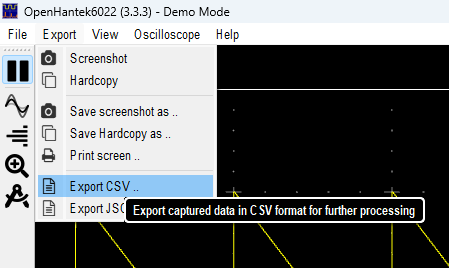

# csv2wav

This is a simple python script that converts a CSV file to a WAV file. Useful for listening to data produced by [OpenHantek6022](https://github.com/OpenHantek/OpenHantek6022).

## Usage

For instance just run python `python csv2wav.py -i input.csv -o output.wav -t 0 -v 1`.

## Options

- `-i` or `--input` : input CSV file default is `record.csv`
- `-o` or `--output` : output WAV file default is `record.wav`
- `-t` or `--time-field` : time column index in CSV file default is `0`
- `-v` or `--value-field` : value column index in CSV file default is `1`

Csv file can be generated by OpenHantek6022 by selecting the "Export CSV" option in the "Export" menu.

